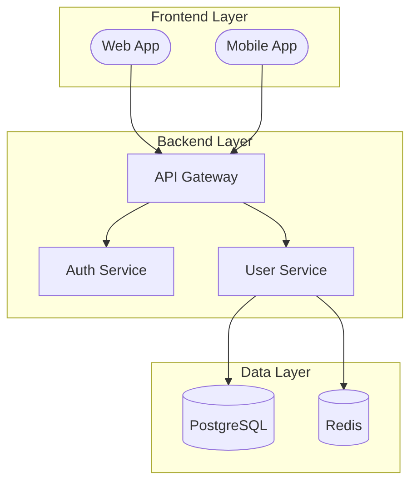
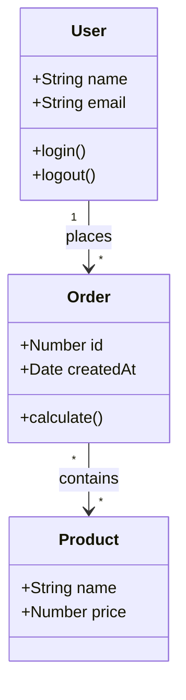
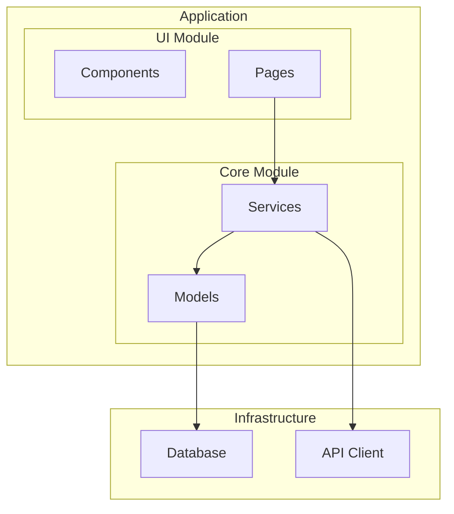
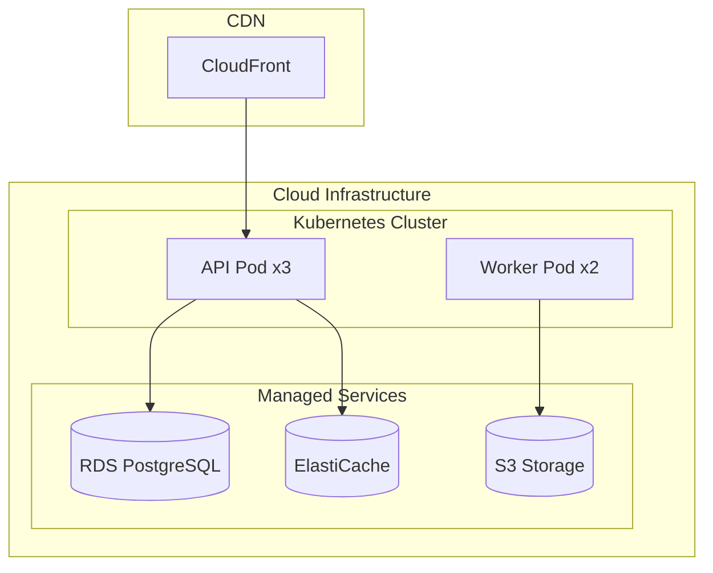
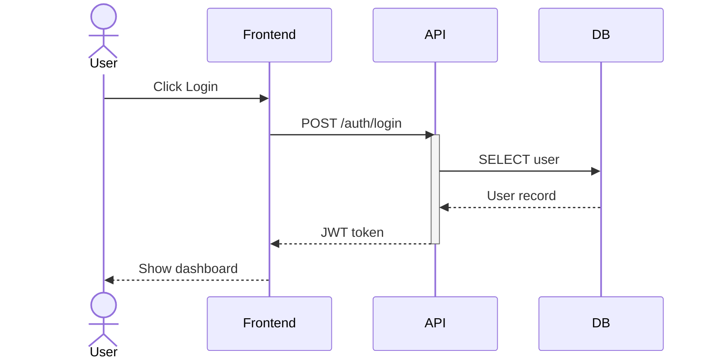
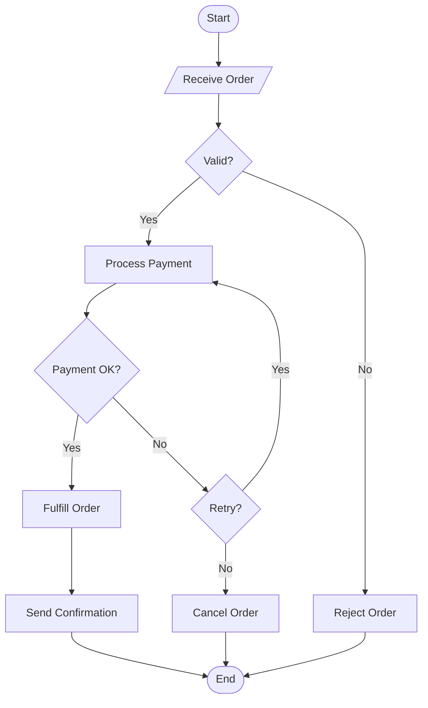
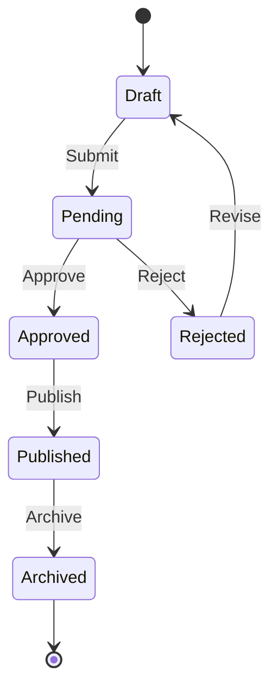

# Supported Diagram Types

## Structural Diagrams

### 1. Component Diagram
**Mermaid syntax**: `flowchart TD`
**Best for**: System architecture overview, service boundaries

**When to use**:
- High-level system overview
- Microservice architecture
- Service dependencies and data flow

### 2. Class Diagram
**Mermaid syntax**: `classDiagram`
**Best for**: Object model, API surface, type relationships

**When to use**:
- Object model documentation
- API type definitions
- Interface/implementation relationships
- Data model visualization

### 3. Package Diagram
**Mermaid syntax**: `flowchart TD` with nested subgraphs
**Best for**: Module organization, dependency boundaries

**When to use**:
- Module boundaries and dependencies
- Monorepo package organization
- Layer architecture visualization

### 4. Deployment Diagram
**Mermaid syntax**: `flowchart TD` with styled subgraphs
**Best for**: Infrastructure layout, deployment topology

**When to use**:
- Cloud architecture
- Infrastructure documentation
- Scaling and redundancy visualization

---

## Behavioral Diagrams

### 5. Sequence Diagram
**Mermaid syntax**: `sequenceDiagram`
**Best for**: Request flows, API interactions, message passing

**When to use**:
- API call flows
- Authentication/authorization flows
- Multi-service interactions
- WebSocket/SSE message flows

### 6. Activity Diagram
**Mermaid syntax**: `flowchart TD`
**Best for**: Business logic, workflow steps, decision trees

**When to use**:
- Business process documentation
- Decision logic visualization
- Error handling flows
- User journey mapping

### 7. State Diagram
**Mermaid syntax**: `stateDiagram-v2`
**Best for**: Entity lifecycle, status transitions

**When to use**:
- Order/ticket lifecycle
- Document workflow states
- Connection/session states
- Feature flag states

---

## Selection Guide

| Scenario | Recommended Type |
|----------|-----------------|
| "How does our system look?" | Component |
| "What are the data types?" | Class |
| "How are modules organized?" | Package |
| "Where is it deployed?" | Deployment |
| "What happens when user clicks X?" | Sequence |
| "What's the business logic?" | Activity |
| "What states can an order be in?" | State |

## Quick Selection Shortcuts

- **[a] All structural**: Component + Class + Package + Deployment
- **[b] All behavioral**: Sequence + Activity + State
- **[c] All**: Generate everything
