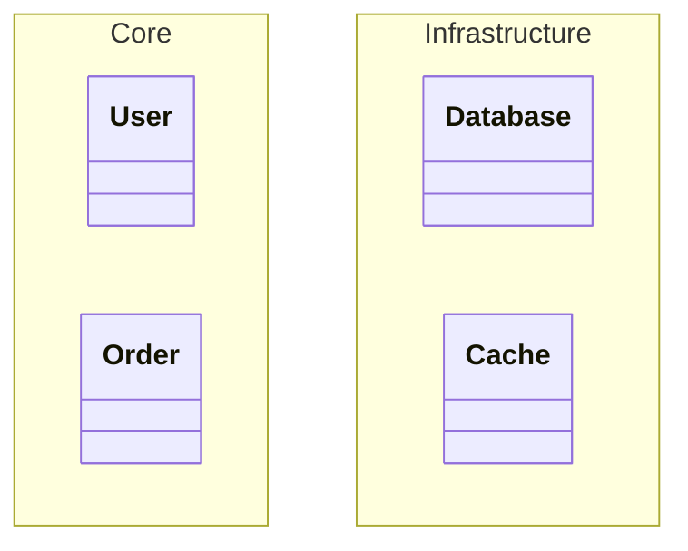
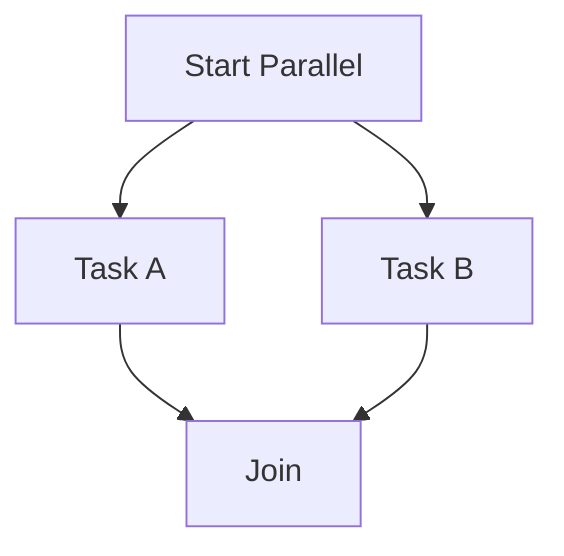
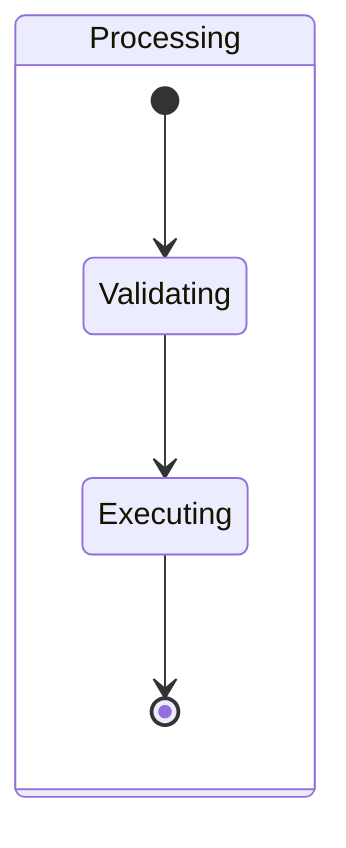
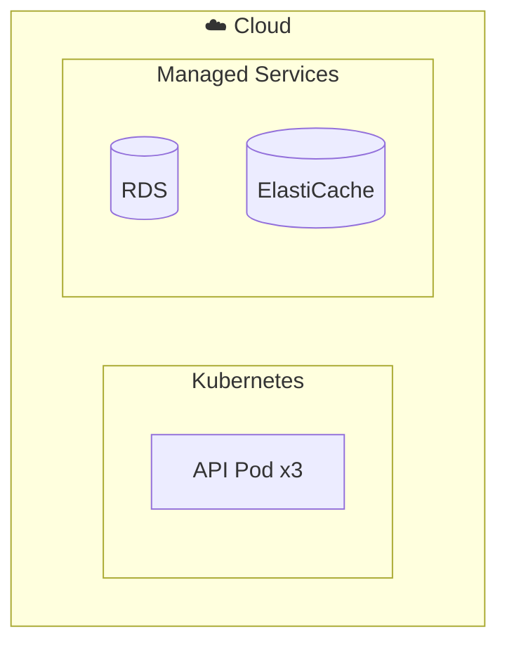

# Mermaid Conversion Patterns

Rules for converting Architecture JSON to Mermaid diagram syntax.

---

## Component Diagram (`flowchart TD`)

### Layer → Subgraph
```
JSON layer:
  { "id": "backend", "name": "Backend Layer", "level": 2 }

Mermaid:
  subgraph backend["Backend Layer"]
    ...
  end
```

### Component → Node (by type)
| Component Type | Mermaid Shape | Example |
|---------------|---------------|---------|
| `frontend-app` | `([name])` stadium | `webapp(["Web App"])` |
| `backend-api` | `[name]` rectangle | `api["API Server"]` |
| `database` | `[(name)]` cylinder | `db[("PostgreSQL")]` |
| `cache` | `[(name)]` cylinder | `redis[("Redis")]` |
| `queue` | `>name]` asymmetric | `mq>"Message Queue"]` |
| `gateway` | `{name}` diamond | `gw{"API Gateway"}` |
| `service` | `[name]` rectangle | `auth["Auth Service"]` |
| `agent` | `[[name]]` subroutine | `worker[["AI Worker"]]` |
| `tool` | `(name)` rounded | `tool("External Tool")` |
| `storage` | `[(name)]` cylinder | `s3[("S3 Storage")]` |
| `container` | subgraph | `subgraph container[...]` |
| `external` | `((name))` circle | `ext(("Third Party"))` |

### Relationship → Arrow
| Relationship Type | Mermaid Arrow | Example |
|------------------|---------------|---------|
| `calls` | `-->` | `api --> auth` |
| `uses` | `-.->` | `api -.-> cache` |
| `depends-on` | `==>` | `api ==> db` |
| `integrates-with` | `<-->` | `api <--> ext` |
| `supports` | `-.->` | `infra -.-> api` |

### Labels
```
{ "from": "api", "to": "db", "label": "SQL queries" }
→ api -->|SQL queries| db
```

### Nested Components (`contains`)
```
JSON:
  { "id": "backend", "type": "container", "contains": [
    { "id": "api", "name": "API", "type": "backend-api" },
    { "id": "worker", "name": "Worker", "type": "service" }
  ]}

Mermaid:
  subgraph backend["Backend"]
    api["API"]
    worker["Worker"]
  end
```

### Styling
```mermaid
%% Apply at end of diagram
classDef frontend fill:#42b883,stroke:#35495e,color:#fff
classDef backend fill:#3498db,stroke:#2c3e50,color:#fff
classDef database fill:#e74c3c,stroke:#c0392b,color:#fff
classDef external fill:#95a5a6,stroke:#7f8c8d,color:#fff

class webapp,mobile frontend
class api,auth,users backend
class db,cache database
class thirdparty external
```

---

## Class Diagram (`classDiagram`)

### Component with methods/properties → Class
```
JSON:
  {
    "id": "user-service",
    "name": "UserService",
    "type": "service",
    "properties": ["+String name", "+String email", "-Number id"],
    "methods": ["+getUser(id) User", "+createUser(data) User", "-validate(data) Boolean"]
  }

Mermaid:
  class UserService {
    +String name
    +String email
    -Number id
    +getUser(id) User
    +createUser(data) User
    -validate(data) Boolean
  }
```

### Relationship → UML Arrow
| Relationship Type | Mermaid Arrow | Meaning |
|------------------|---------------|---------|
| `implements` | `..>` | Interface realization |
| `extends` | `--|>` | Inheritance |
| `calls` | `-->` | Association |
| `uses` | `..>` | Dependency |
| `depends-on` | `*--` | Composition |
| `integrates-with` | `o--` | Aggregation |

### Labels
```
{ "from": "order", "to": "product", "label": "contains", "type": "depends-on" }
→ Order *-- Product : contains
```

### Namespaces (when > 10 classes)


---

## Sequence Diagram (`sequenceDiagram`)

### Actors and Participants
```
JSON sequences.actors: ["User", "Frontend", "API", "Database"]

Mermaid:
  actor User
  participant Frontend
  participant API
  participant Database
```

Rule: First actor uses `actor` keyword, rest use `participant`.

### Step → Message Arrow
| Step Type | Mermaid Arrow | Example |
|-----------|---------------|---------|
| `sync` | `->>` | `Frontend->>API: POST /login` |
| `async` | `-->>` | `API-->>Worker: Process job` |
| `reply` | `-->>` | `API-->>Frontend: 200 OK` |
| `note` | `Note over` | `Note over API: Validate token` |

### Activation
```
JSON: { "from": "Frontend", "to": "API", "message": "POST /login", "type": "sync", "activate": true }

Mermaid:
  Frontend->>API: POST /login
  activate API
  ...
  API-->>Frontend: JWT token
  deactivate API
```

### Notes
```
JSON: { "from": "API", "to": "API", "message": "Validate input", "type": "note" }

Mermaid:
  Note over API: Validate input

JSON: { "from": "API", "to": "DB", "message": "Transaction", "type": "note" }

Mermaid:
  Note over API,DB: Transaction
```

---

## Activity Diagram (`flowchart TD`)

### Conversion Patterns
| Element | Mermaid Syntax |
|---------|---------------|
| Start | `start([Start])` |
| End | `done([End])` |
| Action | `action["Do something"]` |
| Decision | `decision{Condition?}` |
| Input/Output | `io[/"Input data"/]` |
| Parallel (fork) | Subgraph with concurrent paths |

### Decision Branches
```
decision{Valid?} -->|Yes| success["Process"]
decision{Valid?} -->|No| failure["Reject"]
```

### Parallel Activities


---

## State Diagram (`stateDiagram-v2`)

### States and Transitions
```
JSON:
  {
    "states": ["Draft", "Pending", "Approved", "Published"],
    "transitions": [
      { "from": "[*]", "to": "Draft", "trigger": "" },
      { "from": "Draft", "to": "Pending", "trigger": "Submit" },
      { "from": "Pending", "to": "Approved", "trigger": "Approve" }
    ]
  }

Mermaid:
  stateDiagram-v2
    [*] --> Draft
    Draft --> Pending : Submit
    Pending --> Approved : Approve
```

### Special States
- Initial: `[*] --> FirstState`
- Final: `LastState --> [*]`

### Composite States


---

## Package Diagram (`flowchart TD` + subgraphs)

### Module → Nested Subgraph
```
JSON layer with contains:
  { "id": "app", "components": [
    { "id": "ui", "type": "container", "contains": [
      { "id": "pages", "name": "Pages", "type": "frontend-app" }
    ]},
    { "id": "core", "type": "container", "contains": [
      { "id": "services", "name": "Services", "type": "service" }
    ]}
  ]}

Mermaid:
  subgraph app["Application"]
    subgraph ui["UI Module"]
      pages(["Pages"])
    end
    subgraph core["Core Module"]
      services["Services"]
    end
  end
```

---

## Deployment Diagram (`flowchart TD` + styled subgraphs)

### Infrastructure → Subgraphs


### Styling for Infrastructure
```
classDef cloud fill:#f0f4ff,stroke:#4a90d9
classDef k8s fill:#326ce5,color:#fff
classDef managed fill:#ff9900,color:#fff
```

---

## General Tips

1. **ID Sanitization**: Replace special characters in IDs with hyphens for Mermaid compatibility
2. **Label Escaping**: Wrap labels containing special characters in double quotes
3. **Max Nodes**: Keep to 15-20 nodes per diagram; split if larger
4. **Direction**: Use `TD` (top-down) for hierarchical, `LR` (left-right) for sequential flows
5. **Subgraph Nesting**: Max 3 levels deep for readability
